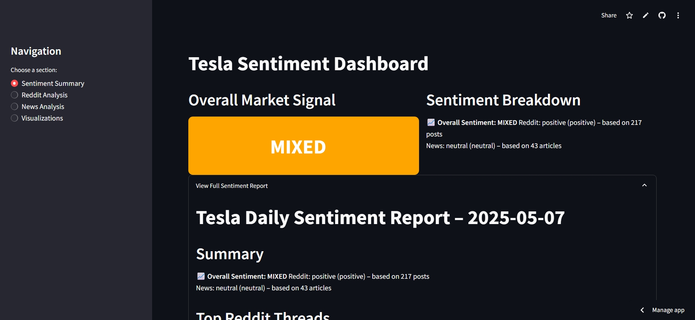
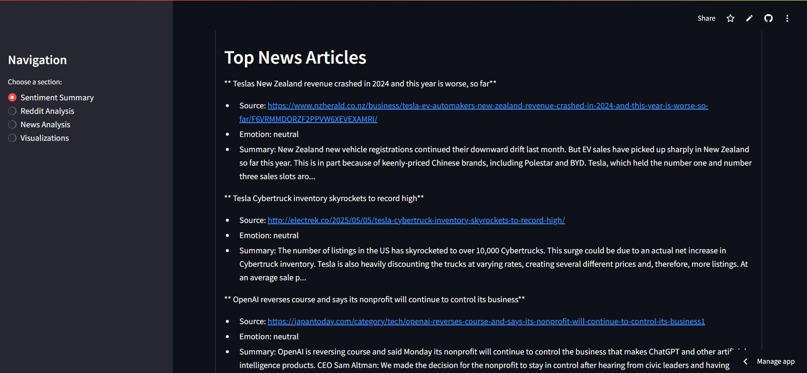
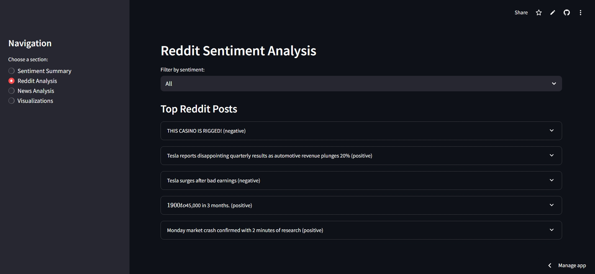
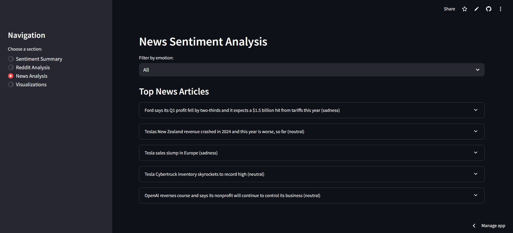
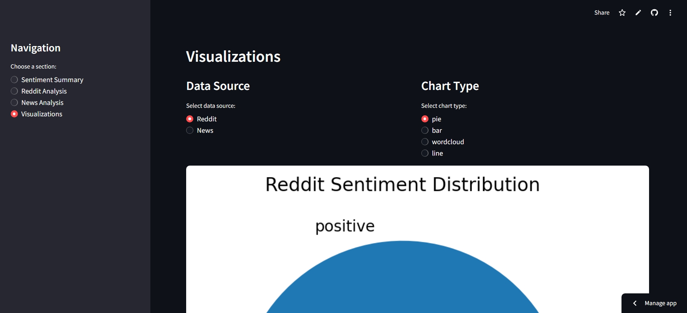

# Stock Sentiment Analysis Dashboard (Stock Sensei v1)

**Track Tesla’s market sentiment in real time from Reddit and financial news using NLP and interactive visualizations.**  
Built with Python, Streamlit, and real-time APIs, this dashboard captures public sentiment and presents it in a clear, actionable format.

---

## Live Demo 

> https://stocksensei-ce4qxak9ugzjjmmt5hb5ze.streamlit.app/)

---

## Features

- Scrape Tesla-related posts from Reddit and top financial news APIs
-  Perform sentiment and emotion analysis on posts and articles
-  Visualize market sentiment using pie charts, bar graphs, time series, and word clouds
-  Generate an automated market signal (bullish/bearish/mixed)

---

## 🛠️ Tech Stack

| Layer        | Tools/Frameworks                                      |
|--------------|--------------------------------------------------------|
| Language     | Python 3                                               |
| Web App      | Streamlit                                              |
| NLP          | (Plug your model: e.g., TextBlob, VADER, Transformers) |
| Reddit Data  | `praw` (Reddit API)                                    |
| News Sources | `NewsAPI`, `GNews`, `newspaper3k`                      |
| Visualization| `matplotlib`, `wordcloud`, `pandas`                    |
| Secrets Mgmt | `.env` with `python-dotenv`                            |

---

## Project Structure
  Stock-Sensei/
├──  data/
│ ├── reddit_tesla_collected.csv
│ └── tesla_news_collected.csv
├──  Scrapping/
│ ├── Reddit_scrapper.py
│ └── Newspaper_scraper.py
├──  Chat/
│ └── 12.py
│ └── text.py
├──  nlp/
│ └── Stock.ipnyb
├── .env
├── README.md
└── requirements.txt

## How to Run It

### 1. Clone the repository

```bash
git clone https://github.com/paoins/Stock_Sensei.git
cd Stock_Sensei
```

### 2. Install dependencies

```bash
pip install -r requirements.txt
```

### 3. Add API keys to `.env`

Create a `.env` file in the root directory:

```ini
NEWS_API_KEY=your_newsapi_key
GNEWS_API_KEY=your_gnews_key
client_id=your_reddit_client_id
client_secret=your_reddit_secret
```

### 4. Run the data scrapers

```bash
python scripts/Reddit_scrapper.py
python scripts/Newspaper_scraper.py
```

### 5. Launch the Streamlit dashboard

```bash
streamlit run app/streamlit_dashboard.py
```
--
## Preview






---

## Future Plans (Stock Sensei v2)

- Predict stock movement using stored sentiment + price data  
- Add support for custom watchlists and other tickers  
- Dashboard with signals, trends, and keyword tracking
- Telegram/email alerts when sentiment spikes
- Explainable AI: "Bearish due to spike in 'recall', 'lawsuit', and 'drop'"
---

## 👨‍💻 Author

**Achraf Baba**  
AI & Data Engineering Student  

- 🔗 [LinkedIn]([https://linkedin.com/in/yourprofile](https://www.linkedin.com/in/achraf-baba-7b8726210/))  


